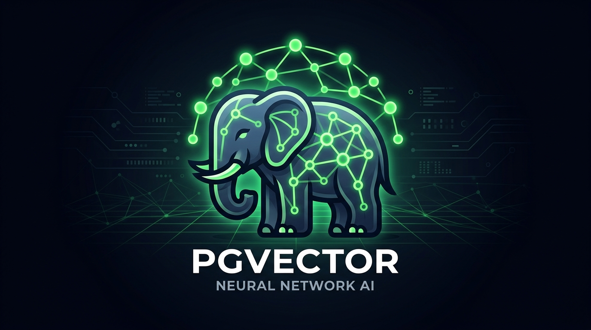
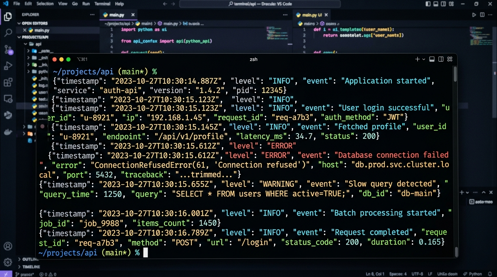

As backend engineers, we often dread two major issues:
1. Code turning into messy spaghetti as the project scales.
2. Dependency hell where environment breaks unexpectedly across dev and production.

While designing a production-grade async backend service for GenAI and high-concurrency workloads, I refined a clean Python architecture pattern (`Async Core Engine`). Here are my key takeaways and personal learnings.

---

### 💡 Why Structure It This Way?

Many tutorials dump all endpoints in `main.py` or simple `routers/`. That becomes a nightmare as features grow.

I prefer a **Domain-Driven Modular** mindset:

```text
├── .github/workflows/      # CI/CD pipelines
├── alembic/                # Database migrations
├── app/
│   ├── api/                # Network Transport Layer (HTTP / WebSockets)
│   │   ├── socket/         # WebSocket handlers
│   │   └── v1/             # RESTful API routers
│   ├── core/               # System-wide components (Database, Exception Handlers)
│   │   ├── database/       # ORM definitions and Async Engine
│   │   ├── logging_config.py # Structured JSON logging via structlog
│   │   └── settings.py     # Pydantic environment configurations
│   ├── integrations/       # External wrappers (Redis, Cloud SQL Proxy)
│   ├── modules/            # 💡 Core Business Logic (High Cohesion Modules)
│   │   └── posts/          # e.g., Posts / Blog module (Schemas, Services, DB Models)
│   └── main.py             # ASGI entrypoint & lifespan
├── docker-compose.yml      # Local dev environment
├── pyproject.toml          # Fast package management via uv
└── uv.lock                 # Strict dependency lockfile
```

> **Key Takeaway**: Decoupling domain business logic (`modules/posts/`) from transport routing (`api/v1/posts.py`) allows changing web frameworks or adding background workers without touching core business rules.

---

### 🔥 Game-Changer Tech Choices

#### 1. Ditch `pip` for `uv`
Package resolution with `uv` written in Rust is **blazing fast** (seconds instead of minutes).

#### 2. Native Vector Search with PostgreSQL + `pgvector`



No need to maintain complex vector databases. Native `pgvector` with HNSW index inside PostgreSQL handles millions of embeddings seamlessly alongside relational queries.

#### 3. Structured JSON Logging with `structlog`



Console logs are readable, and tracing production logs in Grafana Loki or Cloud Logging with contextual JSON becomes effortless.

---

### 🛠️ Practical Workflow: Adding a Feature

Adding a new module (like `posts`) is extremely straightforward:

1. Define SQLAlchemy Model and Pydantic Schemas in `app/modules/posts/`.
2. Run `alembic revision --autogenerate -m "add posts table"`.
3. Wire the endpoint router in `app/api/v1/posts.py`.

No context switching or jumping between unrelated files!
